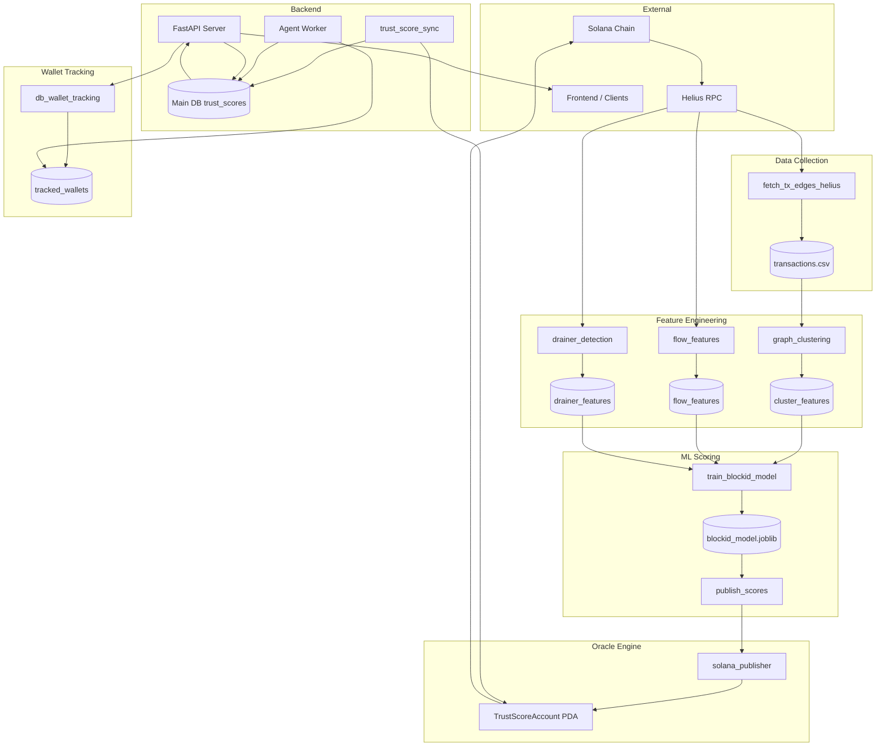

# BlockID Architecture

## 1. Overview

BlockID is a **behavioral trust oracle for Solana wallets**. It collects on-chain transaction data, extracts behavioral features (graph clustering, flow patterns, drainer heuristics), runs a RandomForest ML model to compute scam probability, converts it to a 0–100 trust score, and publishes scores to Anchor PDA accounts. External clients read scores via REST API or on-chain. The system supports real-time monitoring via the agent worker and scheduled batch publishing.

---

## 2. System Components

### Data Collection

**Scripts:** `fetch_tx_edges_helius.py`, `get_100_wallets_from_helius.py`, `get_100_wallets_bonk.py`, `helius_extract_fields.py`

- **fetch_tx_edges_helius.py** — Downloads transaction edges (sender, receiver) for a wallet list using Helius RPC. Uses `getSignaturesForAddress` and `getTransaction` (jsonParsed); extracts native transfer edges. Writes `backend_blockid/data/transactions.csv` with columns `from`, `to`. Rate-limited with retries on 429.
- **Helius RPC** — Primary data source. Configurable via `SOLANA_RPC_URL` or `HELIUS_API_KEY`. Falls back to mainnet Helius URL when key is set.
- **Output:** `transactions.csv` feeds graph clustering; wallet lists come from `manual_wallets.csv`, `test_wallets_100.csv`, or `wallets.csv`.

---

### Feature Engineering

**Scripts:** `graph_clustering.py`, `flow_features.py`, `drainer_detection.py`

- **graph_clustering.py (STEP 1)** — Builds NetworkX graph from `transactions.csv` and `scam_wallets.csv`. Computes `neighbor_count`, `scam_neighbor_count`, `cluster_size`, `distance_to_scam`. Writes `graph_cluster_features.csv`.
- **flow_features.py (STEP 2)** — Per-wallet flow analysis via Helius. Extracts `total_tx`, `unique_destinations`, `rapid_tx_count`, `avg_tx_interval`, `percent_to_new_wallets`, `tx_chain_length_estimate`. Writes `flow_features.csv`.
- **drainer_detection.py (STEP 3)** — Drainer heuristics: `approval_like_count`, `rapid_outflow_count`, `multi_victim_pattern`, `new_contract_interaction_count`, `swap_then_transfer_pattern`, `percent_to_same_cluster`. Writes `drainer_features.csv`.
- **Output CSVs** — Merged on `wallet` for ML training and prediction.

---

### ML Scoring Engine

**Scripts:** `train_blockid_model.py`, `train_model.py`, `train_token_scam_model.py`, `predict_wallet_score.py`, `publish_scores.py` (inference)

- **train_blockid_model.py** — Loads `wallet_scores.csv` (base), merges `cluster_features`, `flow_features`, `drainer_features` on `wallet`. Label from `scam_probability >= 0.5`. Trains `RandomForestClassifier` (n_estimators=200). Saves versioned `blockid_model_YYYYMMDD_HHMM.joblib` and `feature_list.txt`.
- **train_model.py** — Trains from analytics JSON/DB or dataset CSV; merges flow + drainer; bins score into classes. Saves `trust_model`.
- **train_token_scam_model.py** — Token scam detection from `token_features.csv` and `scam_wallets.csv`. Saves `token_scam_model`.
- **Inference** — `publish_scores.py` loads latest model via `load_latest_model()`, builds feature vector from CSVs or `wallet_features.csv`, predicts scam probability, converts to trust score `(1 - proba) * 100`.

---

### Oracle Engine

**Scripts:** `publish_scores.py`, `publish_wallet_scores.py`, `publish_one_wallet.py`, `solana_publisher.py`

- **publish_scores.py (STEP 5)** — ML-driven publish: load model, predict, convert to 0–100, call `update_trust_score` for each wallet. Batch mode reads `wallets.csv`.
- **publish_wallet_scores.py** — CSV-driven publish: reads `wallet_scores.csv`, `trust_score = 100 - risk_score`, invokes `publish_one_wallet.py` per wallet.
- **solana_publisher.py** — Builds `update_trust_score` instruction from Anchor IDL. PDA seeds: `[b"trust_score", oracle.key(), wallet.key()]`. Sends transaction via solana-py.
- **TrustScoreAccount PDA** — On-chain layout: discriminator (8) + wallet (32) + score (1) + risk (1) + updated_at (8). Program ID from `ORACLE_PROGRAM_ID`.

---

### Backend API

**Modules:** `api_server/server.py`, `api_server/trust_score.py`, `api_server/app.py`

- **FastAPI** — ASGI app. Endpoints: `GET /api/trust-score/{wallet}`, `POST /api/trust-score/list`, `GET /wallet/{address}`, `GET /health`, `POST /track-wallet`, `POST /track_wallet`, `GET /tracked_wallets`, `POST /import_wallets_csv`, `GET /wallet_report/{wallet}`, `GET /debug/wallet_status/{wallet}`.
- **Trust score** — Reads from main DB `trust_scores` table; enriches with oracle_pubkey and PDA. DB populated by publish pipeline and `trust_score_sync`.
- **Wallet tracking** — Step 2 tracking via `db_wallet_tracking` (SQLAlchemy). Register wallets, import CSV, list tracked.

---

### Database Layer

**Modules:** `database/database.py`, `api_server/db_wallet_tracking.py`

- **Main DB (database.py)** — SQLite (MVP) or PostgreSQL. Tables: `wallet_profiles`, `transactions`, `trust_scores`, `tracked_wallets`, `alerts`, `wallet_rolling_stats`, `wallet_escalation_state`, `wallet_priority`, `wallet_reputation_state`, `wallet_graph_edges`, `wallet_clusters`, `wallet_cluster_members`, `entity_profiles`, `entity_reputation_history`.
- **Wallet tracking DB (db_wallet_tracking.py)** — SQLAlchemy. Tables: `tracked_wallets` (wallet, label, last_score, last_risk, reason_codes), `score_history`. Uses `DATABASE_URL` for PostgreSQL or SQLite fallback (`WALLET_TRACKING_DB_PATH`).
- **Sync** — `trust_score_sync.py` polls on-chain PDA every 5 minutes, inserts into `trust_scores`.

---

### Agent Worker

**Modules:** `agent_worker/runner.py`, `agent_worker/worker.py`, `agent_worker/priority_scheduler.py`

- **Periodic runner** — Started by FastAPI lifespan. Fetches tracked wallets from DB, runs analytics pipeline (features, anomalies, trust score, risk propagation, alerts), writes to DB. Interval from `PERIODIC_INTERVAL_SEC` (default 30s). Real-time monitoring foundation.
- **Analytics pipeline** — `update_wallet_graph` → `extract_features` → `detect_anomalies` → `compute_trust_score` → `propagate_risk` → `evaluate_and_store_alerts`.
- **Scheduler** — `priority_scheduler` selects wallets by priority (high-risk, normal). Uses `scheduler/engine` for candidate selection.

---

### Alerts Engine

**Modules:** `alerts/engine.py`, `alerts/escalation.py`

- **engine.py** — Risk thresholds, anomaly-to-alert severity mapping. Triggers when trust score < 50 or anomaly severity >= MEDIUM. Stores alerts in DB with cooldown deduplication.
- **escalation.py** — Escalation state per wallet; can notify admin (e.g. blockidscore@gmail.com) on critical alerts.

---

## 3. Architecture Diagram



---

## 4. Data Flow Summary

| Stage | Input | Output |
|-------|-------|--------|
| Data collection | Helius RPC, wallet list | transactions.csv |
| Graph clustering | transactions.csv, scam_wallets.csv | graph_cluster_features.csv |
| Flow features | Helius RPC, wallet list | flow_features.csv |
| Drainer features | Helius RPC, wallet list | drainer_features.csv |
| ML training | wallet_scores + merged features | blockid_model_*.joblib |
| Publishing | Model + features + wallets | Solana PDA |
| Sync | On-chain PDA | trust_scores table |
| API | trust_scores, tracked_wallets | JSON response |

---

## 5. Data Pipeline (STEP 0–5)

End-to-end flow from raw transactions to on-chain PDA:

| Step | Script | Input | Output |
|------|--------|-------|--------|
| **STEP 0** | `fetch_tx_edges_helius.py` | Wallet list, Helius RPC | `transactions.csv` (from, to) |
| **STEP 1** | `graph_clustering.py` | transactions.csv, scam_wallets.csv | `graph_cluster_features.csv` |
| **STEP 2** | `flow_features.py` | Wallet list, Helius RPC | `flow_features.csv` |
| **STEP 3** | `drainer_detection.py` | Wallet list, Helius RPC | `drainer_features.csv` |
| **STEP 4** | `train_blockid_model.py` | wallet_scores.csv + merged features | `blockid_model_*.joblib`, `feature_list.txt` |
| **STEP 5** | `publish_scores.py` | Model, features, wallets.csv | Solana TrustScoreAccount PDA |

**Pipeline execution order:** Run STEP 0 first to populate transactions; STEP 1–3 can run in parallel (each needs wallet list + Helius). STEP 4 trains on merged CSVs. STEP 5 publishes after training.

---

## 6. Identity Model

### Wallet Clustering

**Module:** `analysis_engine/identity_cluster.py`

- **Purpose:** Group wallets that likely belong to the same entity. Heuristic rules (no ML).
- **Rules:** Bidirectional transfers, shared funding source, burst timing patterns, fan-in/fan-out structure, circular flow.
- **Storage:** `wallet_clusters`, `wallet_cluster_members`, `entity_profiles`.
- **Reason tags:** `bidirectional`, `shared_funding`, `fan_in_out`, `burst_timing`, `circular`.
- **Effect:** Cluster risk increases if any member is risky. Final trust score = base − anomaly − graph − cluster penalty.

### Risk Propagation

**Module:** `analysis_engine/risk_propagation.py`

- **Purpose:** Propagate partial risk from anomalous neighbors through the wallet graph.
- **Mechanism:** BFS up to 2 hops; penalty decays by distance (0.5 per hop). Cap at 20.0 total penalty.
- **Input:** Trust score metadata (`is_anomalous`), wallet graph edges.
- **Output:** `adjusted_score = base_score - propagated_risk_penalty`. Deterministic, explainable.

---

## 7. Deployment Architecture

| Component | Configuration | Notes |
|-----------|---------------|-------|
| **Solana** | `SOLANA_RPC_URL`, `SOLANA_DEVNET`, `SOLANA_CLUSTER` | Devnet: `SOLANA_DEVNET=1` or `SOLANA_CLUSTER=devnet`. Default RPC: mainnet-beta or devnet. |
| **Helius RPC** | `HELIUS_API_KEY` | Fallback URL: `https://mainnet.helius-rpc.com/?api-key={key}`. Used for tx history, flow, drainer. |
| **Oracle signer** | `ORACLE_PRIVATE_KEY` | Keypair path or base58. Signs `update_trust_score` transactions. |
| **Oracle program** | `ORACLE_PROGRAM_ID` | Deployed Anchor program ID. |
| **FastAPI server** | `API_HOST`, `API_PORT` | Default 0.0.0.0:8000. Uvicorn ASGI. |
| **Main DB** | `DB_PATH` | SQLite file (default `blockid.db`). PostgreSQL via swap in `database.py`. |
| **Wallet tracking DB** | `DATABASE_URL`, `WALLET_TRACKING_DB_PATH` | PostgreSQL when `DATABASE_URL` set; else SQLite. |

**Typical devnet setup:**

```bash
SOLANA_RPC_URL=https://api.devnet.solana.com
SOLANA_DEVNET=1
ORACLE_PRIVATE_KEY=path/to/id.json
ORACLE_PROGRAM_ID=<deployed_program_id>
HELIUS_API_KEY=<key>
DB_PATH=blockid.db
```

---

## 8. Future Components

| Component | Description |
|-----------|-------------|
| **Real-time monitoring agent** | Solana RPC subscription or Helius webhook for live tx events; batch scanner fallback. Agent worker already runs periodic analysis; future: event-driven ingestion. |
| **Cross-chain identity** | Map wallet identities across Solana and other chains. Extend clustering and entity_profiles to multi-chain. |
| **OpenClaw integration** | Monitoring agent integration (OpenClaw spec reference). |
| **Graph neural network** | Replace or augment RandomForest with GNN for graph-structured wallet data. Captures higher-order neighborhood patterns. |
