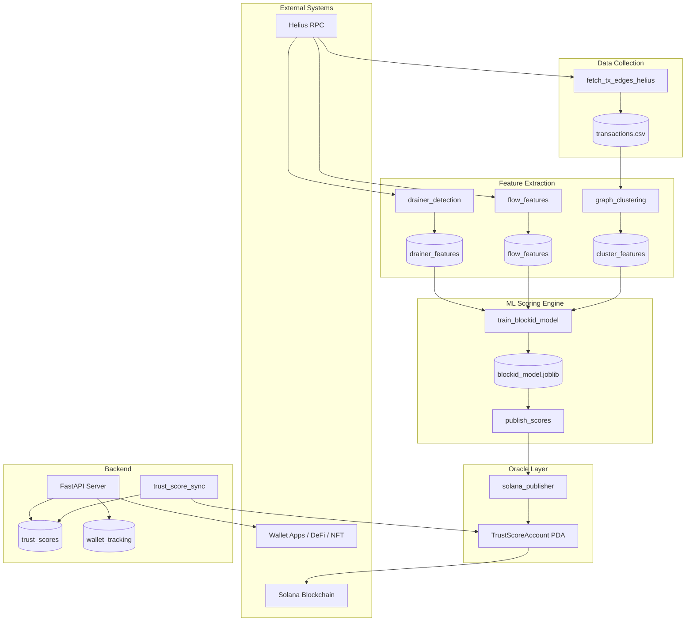

# BlockID Whitepaper (Draft)

## 1. Abstract

BlockID is a **behavioral trust oracle for Web3** that reduces scam exposure by scoring Solana wallets based on on-chain behavior. It combines graph clustering, flow analysis, drainer heuristics, and machine learning to produce transparent, explainable trust scores stored on-chain in Program Derived Addresses (PDAs). By treating *identity* as a cluster of related wallets rather than a single address, BlockID enables wallet apps, NFT marketplaces, DeFi platforms, and agent reputation systems to query trust before transacting—without relying on centralized reputation databases. This document describes the architecture, detection methods, trust model, and integration strategy for BlockID as foundational trust infrastructure for the Web3 economy.

---

## 2. Problem Statement

### Scam Wallets

On Solana, thousands of scam wallets execute phishing, token rug pulls, NFT scams, and drainer attacks. Victims lose funds because wallet addresses are opaque: a new address carries no prior reputation. Scammers exploit this by creating fresh wallets for each campaign, making traditional address-blocklists ineffective.

### Wallet Anonymity Abuse

Pseudonymous wallets allow actors to operate without accountability. A single entity can control dozens of addresses—funding them from a common source, moving assets in coordinated bursts—while appearing as unrelated users. This anonymity enables fraud at scale.

### Sybil Attacks

In reputation systems, Sybil attacks occur when one entity creates many identities to manipulate scores, voting, or rewards. On Solana, Sybil wallets can inflate token holder counts, game airdrops, or create fake “trusted” counterparties. Without identity clustering, each wallet is treated independently, making Sybil resistance impossible.

### Fake Identity in Web3

NFT creators, DeFi liquidity providers, and trading bots often present single addresses as their “identity.” In reality, sophisticated actors use multiple wallets for obfuscation, wash trading, or front-running. BlockID addresses this by modeling *identity* as a behavioral cluster of related wallets, not a single public key.

### Solana Ecosystem Context

Solana’s high throughput and low fees accelerate scam velocity. Drainer kits, token mints with malicious metadata, and approval-based theft are common. BlockID uses Helius RPC data to analyze transaction graphs, flow patterns, and approval-like interactions—all derived from public on-chain data—to detect these patterns before they cause further harm.

---

## 3. Vision

### Trust Infrastructure for the Web3 Economy

BlockID aims to provide **trust infrastructure** that any Solana application can consume: a shared, on-chain layer of behavioral trust scores that reduces fraud without centralizing identity or requiring KYC.

### Identity Clustering

A critical insight is: **a wallet is not an identity**. One person or bot can control many wallets. BlockID groups wallets into *identity clusters* using behavioral heuristics: bidirectional transfers, shared funding sources, burst timing, fan-in/fan-out structure, and circular flows. Trust is computed at the cluster level where possible, then propagated to individual wallets.

### Behavioral Fingerprint

Each wallet leaves a *behavioral fingerprint* in its transaction history: whom it transacts with, how fast it moves funds, whether it interacts with known scam programs or drainer contracts, and its position in the transaction graph relative to known scams. BlockID extracts these signals into features, runs a RandomForest classifier, and converts scam probability into a 0–100 trust score stored on-chain.

---

## 4. Architecture Overview

BlockID consists of the following components:

| Component | Role |
|-----------|------|
| **Solana blockchain** | Target chain for trust score PDAs; source of public transaction data |
| **Helius RPC** | Primary data source for transaction history, signatures, and parsed transaction data |
| **Feature extraction engine** | Graph clustering, flow analysis, drainer detection → CSV feature sets |
| **ML scoring engine** | RandomForest model; predicts scam probability, converts to trust score |
| **Oracle publisher** | Builds `update_trust_score` instruction; signs and sends transactions |
| **Anchor TrustScoreAccount PDA** | On-chain account: discriminator (8) + wallet (32) + score (1) + risk (1) + updated_at (8) + oracle (32) |
| **Wallet Tracking DB** | PostgreSQL or SQLite; tracks wallets for batch publish, score history |
| **FastAPI API** | REST endpoints for trust score lookup, wallet registration, batch queries |



---

## 5. Identity Model

### Wallet ≠ Identity

A single public key does not represent a unique human or bot. BlockID models **identity** as a cluster of wallets that exhibit linked behavior.

### Identity = cluster(wallets)

Identity clusters are built using heuristic rules (no ML in this step):

- **Bidirectional transfers** — Wallets that send and receive between each other
- **Shared funding source** — Wallets funded by the same originating address
- **Fan-in/fan-out** — Common sources or destinations
- **Burst timing** — Activity concentrated in short windows
- **Circular flow** — Asset paths that return to the origin

Clusters are stored in `wallet_clusters` and `wallet_cluster_members`; each cluster has a confidence score and reason tags (e.g. `bidirectional`, `shared_funding`).

### Risk Propagation

Risk does not stop at a single wallet. If a neighbor in the transaction graph is anomalous, that risk propagates to connected wallets. BlockID uses **BFS up to 2 hops** with a decay factor per hop. The propagated penalty is capped so one bad neighbor cannot destroy an otherwise healthy wallet’s score. This makes the system **explainable** and **deterministic**—each deduction can be traced to a specific neighbor and rule.

---

## 6. Detection Methods

### Graph Clustering

A NetworkX graph is built from `transactions.csv` (from, to edges) and `scam_wallets.csv`. Per-wallet features:

- **neighbor_count** — Number of direct transaction neighbors
- **scam_neighbor_count** — Neighbors that are known scams
- **cluster_size** — Size of connected component
- **distance_to_scam** — Shortest path (edges) to nearest known scam; -1 if unreachable

Example: A wallet 1 hop from a phishing drainer gets `distance_to_scam = 1` and higher `scam_neighbor_count`, signaling elevated risk.

### Flow Analysis

Per-wallet flow features from Helius transaction history:

- **total_tx** — Transaction count
- **unique_destinations** — Distinct receivers
- **rapid_tx_count** — Transactions within a short window (e.g. 30 seconds)
- **avg_tx_interval** — Mean time between transactions
- **percent_to_new_wallets** — Share of recipients with no prior history
- **tx_chain_length_estimate** — Chain of rapid, linked transactions

Example: A drainer often shows high `rapid_tx_count` and `percent_to_new_wallets` as it sweeps many victims quickly.

### Drainer Detection

Heuristic signals for approval-based and sweep attacks:

- **approval_like_count** — Interactions resembling token approvals within a time window
- **rapid_outflow_count** — Fast outflows in a short window
- **multi_victim_pattern** — Many distinct senders funneling to few receivers
- **new_contract_interaction_count** — First-time interactions with programs
- **swap_then_transfer_pattern** — Swap followed quickly by transfer (DEX → external)
- **percent_to_same_cluster** — Share of flows to wallets in the same cluster

Known DEX program IDs (Jupiter, Raydium, Serum) are used to distinguish swaps from native transfers.

### Approval Risk Detection

Approval-like interactions within a configurable window (e.g. 30 seconds) are counted. Wallets that rapidly collect approvals from many sources, then move assets, trigger the multi-victim pattern.

### ML RandomForest Scoring

A `RandomForestClassifier` (n_estimators=200) is trained on merged features from graph, flow, and drainer CSVs. Labels come from `scam_probability >= 0.5` in the base dataset. The model outputs scam probability; trust score = `(1 - scam_probability) * 100`, clamped to 0–100.

---

## 7. Core Pipeline

BlockID runs a five-step pipeline from raw transactions to on-chain PDAs:

| Step | Script | Input | Output |
|------|--------|-------|--------|
| **STEP 0** | `fetch_tx_edges_helius.py` | Wallet list, Helius RPC | `transactions.csv` (from, to) |
| **STEP 1** | `graph_clustering.py` | transactions.csv, scam_wallets.csv | `graph_cluster_features.csv` |
| **STEP 2** | `flow_features.py` | Wallet list, Helius RPC | `flow_features.csv` |
| **STEP 3** | `drainer_detection.py` | Wallet list, Helius RPC | `drainer_features.csv` |
| **STEP 4** | `train_blockid_model.py` | wallet_scores.csv + merged features | `blockid_model_*.joblib`, `feature_list.txt` |
| **STEP 5** | `publish_scores.py` | Model, features, wallet list | TrustScoreAccount PDA on Solana |

**Data lineage:**

```
transactions.csv
  → graph_cluster_features.csv
  → flow_features.csv
  → drainer_features.csv
  → wallet_features.csv (merged)
  → training_dataset.csv
  → blockid_model.joblib
  → wallet_scores.csv
  → PDA publish
```

---

## 8. Trust Score Model

### Trust Score Formula

The ML path computes:

```
trust_score = (1 - scam_probability) * 100
```

normalized to 0–100. A higher score means lower scam likelihood.

The specification also documents a weighted formula for rule-based aggregation:

```
trust_score = success_rate * 0.5 + cluster_risk * 0.3 + drainer_signal * 0.2
```

Both approaches yield scores in 0–100.

### Risk Levels

The on-chain `risk` field is a u8 mapped from the score:

| Score Range | Risk Level | Value |
|-------------|------------|-------|
| ≥ 70 | Low | 0 |
| 50–69 | Medium | 1 |
| 30–49 | High | 2 |
| < 30 | Critical | 3 |

### Reason Codes

Reason codes provide explainability. Examples from the codebase:

- `NEAR_SCAM_CLUSTER` — Proximity to known scam wallets in the graph
- `HIGH_RAPID_TX` — High rapid transaction count
- `MULTI_VICTIM_PATTERN` — Drainer-like multi-sender pattern
- `NEW_CONTRACT_INTERACTION` — First-time program interaction
- `HIGH_APPROVAL_RISK` — Approval-like interaction count
- `SUDDEN_DRAIN_PATTERN` — Sudden outflow pattern
- `NEW_WALLET` — Insufficient history
- `LOW_ACTIVITY` — Low transaction count

Reason codes are stored in metadata and returned by the API.

---

## 9. Oracle Design

### Why On-Chain PDA Storage

Trust scores are stored in Solana PDAs so that:

- **Any program** can read scores without off-chain API calls
- **Transparency** — Scores are verifiable on-chain
- **Censorship resistance** — No single server can revoke access
- **Composability** — DeFi, NFT, and agent contracts can gate actions on trust score

### Oracle Signer Wallet

A dedicated keypair (`ORACLE_PRIVATE_KEY`) signs `update_trust_score` transactions. Only this wallet can write to TrustScoreAccount PDAs. PDA seeds: `[b"trust_score", oracle_pubkey, wallet_pubkey]`.

### Transparency

- Scores are public on-chain
- Reason codes and metadata are exposed via API
- Model version and feature list are tracked (e.g. `BLOCKID_MODEL_VERSION`, `feature_list.txt`)
- Retraining policy: when scam dataset grows or on a schedule; compare ROC-AUC before deploy

---

## 10. API & Integration

### FastAPI Trust Score Endpoints

| Endpoint | Purpose |
|----------|---------|
| `GET /api/trust-score/{wallet}` | Single wallet trust score |
| `POST /api/trust-score/list` | Batch trust scores (1–100 wallets) |
| `GET /wallet/{address}` | Legacy endpoint; trust score + flags + reason codes |
| `POST /track-wallet` | Register wallet for monitoring (agent scheduler) |
| `POST /track_wallet` | Register wallet for publish pipeline |
| `GET /tracked_wallets` | List tracked wallets |
| `POST /import_wallets_csv` | Bulk import from CSV |
| `GET /wallet_report/{wallet}` | Full analytics pipeline run (no publish) |
| `GET /debug/wallet_status/{wallet}` | Check DB and on-chain PDA status |
| `GET /health` | Liveness probe |

### Integration Use Cases

| Integrator | Use Case |
|------------|----------|
| **Wallet apps** | Show trust badge before sending; warn on low score |
| **NFT marketplaces** | Filter or flag listings from high-risk creators |
| **DeFi platforms** | Restrict or warn on counterparties below threshold |
| **Agent reputation systems** | Score AI/agent-controlled wallets for trading or lending |

---

## 11. Security Model

### Oracle Signer Isolation

The oracle keypair is kept separate from application keys. It is used only for signing `update_trust_score`; no user funds are controlled.

### Dataset Hashing

Dataset snapshots can be hashed for auditability. Replay mode uses a fixed snapshot to run the full pipeline without RPC, enabling reproducibility and drift analysis.

### Model Versioning

Models are saved with timestamps: `blockid_model_YYYYMMDD_HHMM.joblib`. Metadata JSON can store `feature_count`, `dataset_size`, `accuracy`, `precision`, `recall`. ROC-AUC is compared before deploying a new model.

### Replay Mode

Run the pipeline on a historical dataset without live RPC. Compare trust score drift and validate model behavior before production publish.

---

## 12. Anti-Sybil Strategy

BlockID uses cluster-level signals to resist Sybil attacks:

- **Wallet cluster size** — Unusually large clusters may indicate one entity controlling many wallets
- **Rapid wallet creation** — Burst of new addresses funded from a common source
- **Shared funding source** — Wallets funded by the same origin
- **Identical behavior pattern** — Similar flow, graph, and drainer features across many wallets

By clustering wallets and propagating risk within clusters, a Sybil attacker cannot easily create many “clean” identities—related wallets share risk.

---

## 13. Limitations

- **Cannot stop on-chain transactions** — BlockID is informational. It does not block or reverse transactions.
- **Behavioral detection only** — Relies on transaction patterns; cannot detect scams before first interaction.
- **Requires labeled scam dataset** — Training and graph features depend on `scam_wallets.csv` and similar ground truth.
- **Retrospective** — Scores reflect past behavior; new attacks may not be flagged until patterns are learned.
- **Potential false positives** — Legitimate power users or market makers may trigger rapid-tx or flow heuristics.

---

## 14. Future Roadmap

| Component | Description |
|-----------|-------------|
| **Real-time monitoring agent** | Solana RPC subscription or Helius webhook for live events; batch scanner fallback |
| **Cross-chain identity** | Map wallet identities across Solana and other chains |
| **OpenClaw integration** | Monitoring agent integration per OpenClaw spec |
| **Graph neural network** | Replace or augment RandomForest with GNN for graph-structured data |
| **Public trust API** | Documented, rate-limited public API for third-party integrators |

---

## 15. Token / Revenue Model

Possible revenue streams (conceptual):

| Stream | Description |
|--------|-------------|
| **API subscription** | Tiered access: free tier for low volume; paid for high-volume or batch queries |
| **Enterprise analytics** | Custom dashboards, risk reports, and bulk exports |
| **Marketplace integration** | Revenue share or fee for NFT/DeFi platforms that integrate BlockID |
| **Risk scoring API** | Per-call or per-wallet pricing for trust score lookups |

*No token mechanics or specific numbers are defined in the current codebase.*

---

## 16. Deployment Plan

### Devnet → Mainnet Rollout

1. **Devnet** — Deploy Anchor program, oracle keypair, and run full pipeline on devnet RPC.
2. **Test** — Validate PDA layout, `update_trust_score` instruction, and API sync.
3. **Mainnet** — Deploy program to mainnet; configure Helius mainnet RPC and mainnet oracle keypair.
4. **Monitor** — Track publish success rate, RPC latency, false positive reports.

### Example Configuration

```
SOLANA_CLUSTER=devnet
ORACLE_PROGRAM_ID=CxQ4mo9UQxVZMQ3T9oxvtYL7huBAGMjF8nTxL7XnkuTe
Oracle Signer: 9QCfNuQuxct1Xk9ytFYgxc5fThmTzL4pHQnSjjrVUrka
HELIUS_API_KEY=<key>
```

*Program ID and oracle address are from project documentation; verify before production.*

---

## 17. Conclusion

Trust is a prerequisite for a thriving Web3 economy. Without it, users and protocols are exposed to scams, Sybil attacks, and fake identity. BlockID provides **trust infrastructure** by:

- Modeling identity as clusters of behaviorally linked wallets
- Extracting graph, flow, and drainer features from public on-chain data
- Scoring wallets with an explainable ML model
- Storing scores on-chain in transparent, composable PDAs
- Exposing scores via REST API for wallet apps, marketplaces, DeFi, and agent systems

By building on Solana’s public data and Anchor’s PDA model, BlockID aims to become a shared layer that any application can use to reduce fraud and build user confidence—without centralizing identity or compromising censorship resistance.

---

*Document Version: Draft*  
*Last Updated: 2026-02*
